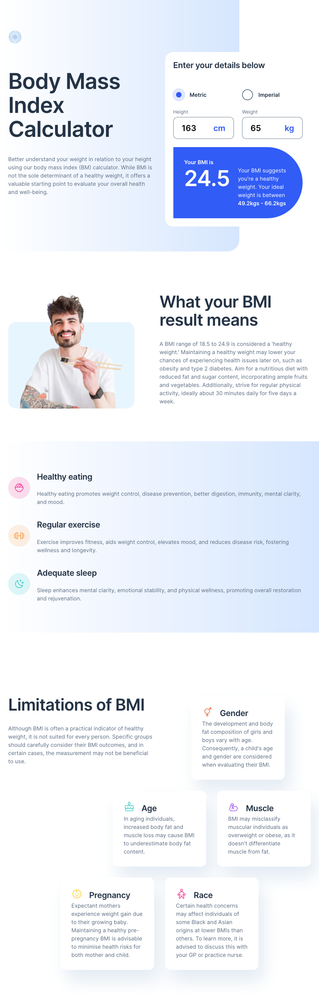

# Frontend Mentor - Body Mass Index Calculator solution

This is a solution to the [Body Mass Index Calculator challenge on Frontend Mentor](https://www.frontendmentor.io/challenges/body-mass-index-calculator-brrBkfSz1T). Frontend Mentor challenges help you improve your coding skills by building realistic projects. 

## Table of contents

- [Overview](#overview)
  - [The challenge](#the-challenge)
  - [Screenshot](#screenshot)
  - [Links](#links)
- [My process](#my-process)
  - [Built with](#built-with)
  - [What I learned](#what-i-learned)
  - [AI Collaboration](#ai-collaboration)
- [Author](#author)


## Overview

### The challenge

Users should be able to:

- Select whether they want to use metric or imperial units
- Enter their height and weight
- See their BMI result, with their weight classification and healthy weight range
- View the optimal layout for the interface depending on their device's screen size
- See hover and focus states for all interactive elements on the page

### Screenshot



### Links

- Solution URL: [https://github.com/katrien-s/fe-26-006-bmi-calculator](https://github.com/katrien-s/fe-26-006-bmi-calculator)
- Live Site URL: [https://fe-26-006-bmi-calculator.netlify.app](fe-26-006-bmi-calculator.netlify.app)

## My process

### Built with

- Semantic HTML5 markup
- CSS custom properties
- Flexbox
- CSS Grid
- Mobile-first workflow


### What I learned

#### How to set the gradient on desktop view as such that it stops in the center of the calculator?

```scss
&::before {
  width: min(75%, calc(50% + #{$wrapper-max-width * 0.25}));
  height: 735px;
}
```

1. From the left edge of the section to the center of the wrapper = 50%
2. From the center of the wrapper to the center of the right column = 25% of the wrapper width

So the total width at max size would be `calc(50% + #{$wrapper-max-width * 0.25})`.

Then you can combine both values with `min()` — using 75% when the wrapper doesn't have side margins yet, and the `calc()` value when it does. The `min()` picks whichever value is smaller at any given viewport width. Before the wrapper hits its max-width, 75% is smaller. After it does, the `calc()` value is smaller. They're equal exactly at the breakpoint where the wrapper stops growing.


### AI Collaboration

I collaborated with **Claude** on this project.
I used Claude to inspect the *DRY*-ness of the code, whether I was not overcomplicating the *HTML*, keeping track of *BEM-naming*. And mostly to *walk me through* the *JavaScript* part.
I find it hard in JavaScript not to go too fast. I want to get the final result immediately and as such I skip crucial thinking patterns. With Claude I was going through the JS more paced and keeping track of the logic behind it. I wrote the code myself, I was just being guided in my thinkingprocess.

## Author

- Frontend Mentor - [@katrien-s](https://www.frontendmentor.io/profile/katrien-s)
